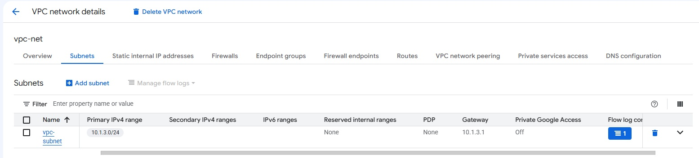
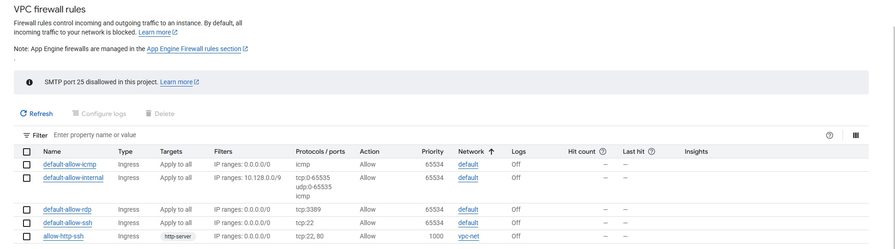
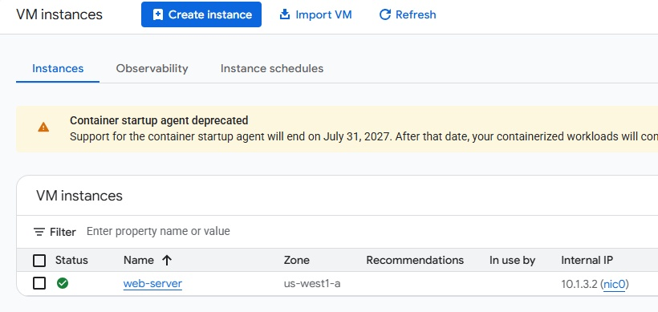
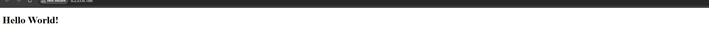
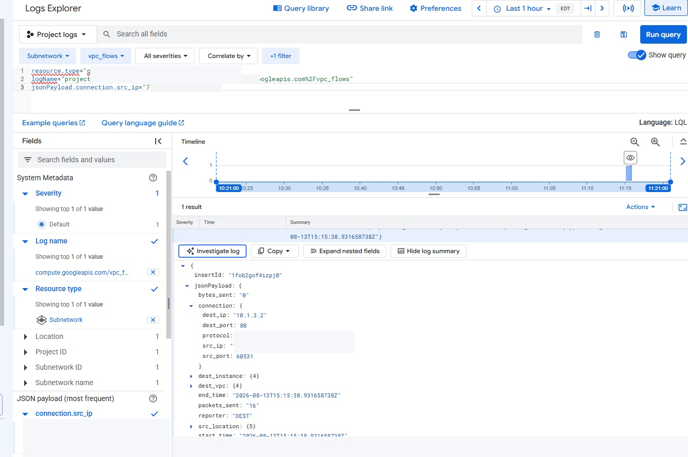
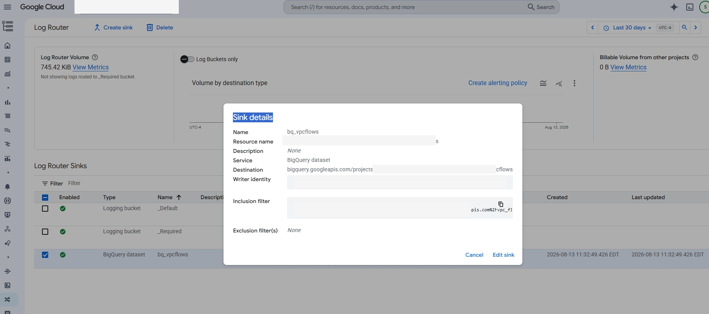
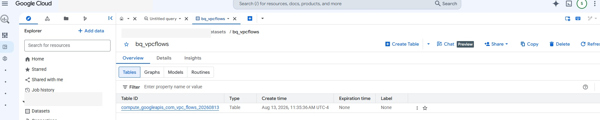
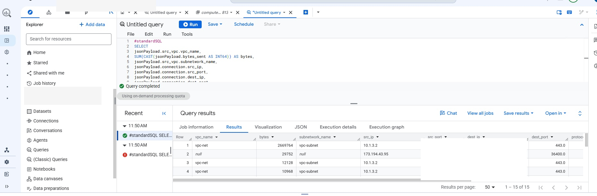
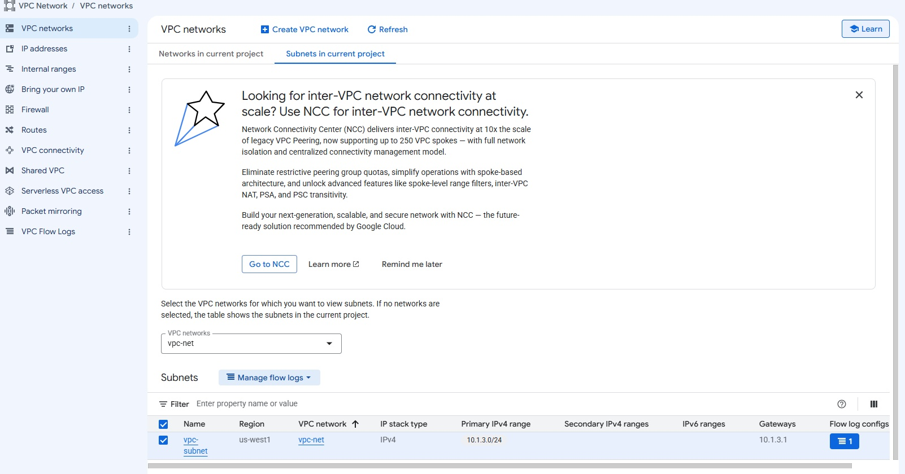

# Analyzing Network Traffic with VPC Flow Logs

Hands-on Google Cloud lab where I enabled VPC Flow Logs, built an Apache web server, traced real HTTP traffic in Logs Explorer, exported the flow logs to BigQuery, and used SQL to analyze the network data.

> **Note:** This was a Google Cloud Skills Boost training lab. It was done for hands-on practice and is not a production environment.

## What I Practiced

- Creating a custom VPC and subnet with VPC Flow Logs enabled
- Using a network tag with a targeted firewall rule
- Running an Apache web server on Compute Engine
- Finding real browser traffic in VPC Flow Logs
- Reading source and destination IPs, ports, and protocol values
- Exporting VPC Flow Logs through Log Router
- Sending the logs to BigQuery
- Generating known HTTP traffic for analysis
- Querying flow-log data with SQL
- Reviewing VPC Flow Log management and aggregation settings

---

## 1. Create a Network with VPC Flow Logs

I created a custom VPC called `vpc-net` with a subnet named `vpc-subnet`.

| Setting | Value |
|---|---|
| Network | `vpc-net` |
| Subnet | `vpc-subnet` |
| CIDR | `10.1.3.0/24` |
| VPC Flow Logs | Enabled |



### What I Learned

VPC Flow Logs have to be enabled for the subnet I want to monitor. The network would still work without them, but I would have much less visibility into the traffic moving through it.

### Why It Mattered

This was the logging foundation for the rest of the lab. I needed Flow Logs turned on before I could trace and analyze the traffic later.

---

## 2. Create the Firewall Rule

I created an ingress firewall rule called `allow-http-ssh`.

| Setting | Value |
|---|---|
| Network | `vpc-net` |
| Target tag | `http-server` |
| Source range | `0.0.0.0/0` |
| Ports | TCP `22`, `80` |
| Action | Allow |



### What I Learned

The `http-server` network tag is what tied the firewall rule to the VM I created next.

### Why It Mattered

I needed HTTP traffic to reach the Apache server so I could generate real network activity and then find that activity in the flow logs.

> The lab used `0.0.0.0/0` for this exercise. In a real environment I would be more careful about how administrative access such as SSH is exposed.

---

## 3. Create the Apache Web Server

I created a Compute Engine VM called `web-server` on `vpc-net` and gave it the `http-server` tag.



After installing Apache, I replaced the default page with a simple `Hello World!` page and opened the server in a browser.



### What I Learned

The VM, network tag, firewall rule, and Flow Logs-enabled subnet all had to line up for the rest of the lab to work.

### Why It Mattered

I now had a real HTTP service generating traffic that I could trace later.

---

## 4. Find My Browser Traffic in VPC Flow Logs

After opening the Apache page, I went to Logs Explorer and filtered the VPC Flow Logs using the source IP from my browser session.

The matching flow record showed:

- Source IP
- Source port
- Destination IP
- Destination port `80`
- Protocol `6` (TCP)



### What I Learned

I was able to take traffic I knew I had generated and find the matching network connection inside VPC Flow Logs.

### Why It Mattered

This showed me how Flow Logs can be used to trace actual network activity instead of only checking whether a server is reachable.

> Public and temporary lab identifiers were redacted from the portfolio screenshot.

---

## 5. Export the Flow Logs to BigQuery

I created a Log Router sink called `bq_vpcflows` and configured it to send VPC Flow Logs to a BigQuery dataset.



I then confirmed that BigQuery had created a VPC Flow Logs table inside the `bq_vpcflows` dataset.



### What I Learned

The Log Router sink is what moved matching log records out of Cloud Logging and into BigQuery.

### Why It Mattered

This connected the logging side of the lab to the analysis side. Once the data was in BigQuery, I could use SQL instead of opening individual records one at a time.

---

## 6. Generate More Traffic

To create a larger set of known traffic, I used Cloud Shell to send 50 HTTP requests to the Apache server.

```bash
export MY_SERVER=<EXTERNAL_IP>

for ((i=1;i<=50;i++)); do curl $MY_SERVER; done
```

The server returned the `Hello World!` response for the requests.


### What I Learned

Generating known test traffic gave me something predictable to look for in the exported logs.

### Why It Mattered

It helped me verify the full path from traffic generation to logging and then into BigQuery.

---

## 7. Analyze the Flow Logs with SQL

I ran a BigQuery query against the exported VPC Flow Logs.

The results included:

- VPC name
- Subnet name
- Source IP and port
- Destination IP and port
- Protocol
- Total bytes sent



### What I Learned

BigQuery made the raw flow-log data much easier to work with. Instead of opening logs individually, I could group and sort the traffic with SQL.

### Why It Mattered

This made it much faster to see which systems were communicating, which ports they were using, and how much traffic was being sent.

---

## 8. Review Flow Log Aggregation

At the end of the lab, I opened the VPC Flow Logs management view for `vpc-subnet` to work with the log-volume settings.



The lab uses aggregation and sampling settings to show the tradeoff between traffic visibility and the amount of log data being stored.

### What I Learned

More detailed logging gives me more visibility, but it also creates more data. Aggregation and sampling can be adjusted when I do not need every possible record at the highest level of detail.

### Why It Mattered

Logging has a cost. The right configuration depends on how much visibility I need and how much log volume I am willing to store and analyze.

> **Evidence note:** I did not preserve a separate screenshot of the final Advanced Settings values after the aggregation changes.

---

## Key Takeaways

- VPC Flow Logs gave me network-level visibility without changing the application.
- Network tags let me target firewall rules to the VM that needed them.
- I could trace known browser traffic back to a specific flow record.
- Flow records showed the source, destination, ports, and protocol used by a connection.
- Log Router let me export VPC Flow Logs into BigQuery.
- BigQuery made it easier to summarize and analyze larger amounts of network traffic with SQL.
- Generating known traffic helped me verify that the logging pipeline was working.
- Flow-log aggregation and sampling are a tradeoff between visibility and log volume.

## Tools and Technologies

`Google Cloud` · `VPC Flow Logs` · `Cloud Logging` · `Logs Explorer` · `Log Router` · `BigQuery` · `SQL` · `Compute Engine` · `Apache` · `HTTP` · `Cloud Shell` · `curl`

## Detailed Notes

My fuller task-by-task notes are in [`docs/lab-notes.md`](docs/lab-notes.md).

## Disclaimer

This repository documents a Google Cloud Skills Boost training lab completed for learning and professional development. The resources were temporary and do not represent a production deployment. No employer, customer, or production data is included.
